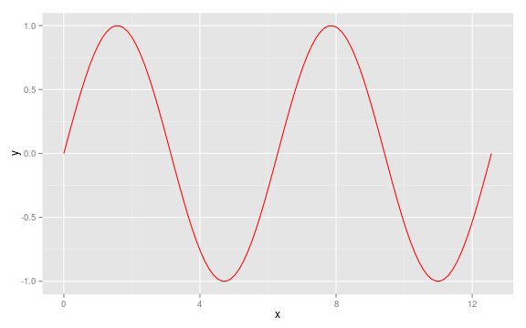

## Trigonometric Function App

There is a permanent need to understand the behavior of periodic phenomena using visualization.  Mathematical models can be use to model such behaviors, and now we can use **R** and **Shiny** to implement a wonderful application that allows us to make interactive changes in the models.

Here I will focus on the function $latex A*\sin(B*\theta)^C$, but the developed app has the capability to calculate and visualize  $latex A*\cos(B*\theta)^C$, and $latex A*\tan(B*\theta)^C$ as well.

*A*, *B*, and *C* are interactive parameters.

---

## About the Functions

In mathematics, the trigonometric functions are relate to the angles of a triangle and the lengths of its sides. They are important in the study of triangles and modeling periodic phenomena, among many other applications in navigation, engineering, and physics.
                               
The most familiar trigonometric functions are the:

1. *Sine* 
2. *Cosine* 
3. *Tangent*

The sine and cosine functions are also commonly used to model periodic
function phenomena such as sound and light waves.

---&twocol

## The Shiny app
*** =left
Run the app, you will find the interactive panel

    

and the tabs

    

*** =right
Now you can change some of the values, just sliding the pointer and observe the result on the selected tab

    

---

## The Shiny app [Cont.]

Here a different tab, using the same parameters

     
  

--- &twocol

## Function Sine
*** =left
The sine of an angle is the ratio of the length of the opposite side to the length of the hypotenuse. Given a unit circle, it is the side of the triangle on which the angle opens. In our case:

$$latex
\frac{A*sin(B*\theta)^D}{C} = \frac{opposite}{hypotenuse} 
$$
*** =right

 

---&twocol

## Plot of Function Sin(x)
*** =left
Each change in the parameters of the function
$latex A*\sin(B*\theta)^C $ will create a new plot.  

1. Black  : $latex \sin(\theta)$

2. Yellow : $latex 2*\sin(\theta)$

3. Blue   : $latex \sin(2*\theta)$

4. Green  : $latex \sin(\theta)^2$

5. Red    : $latex 2*\sin(2*\theta)^2$
*** =right
 

The result of changing all the parameters, this example
$$latex
2*\sin(2*\theta)^2
$$

is shown in **RED**

